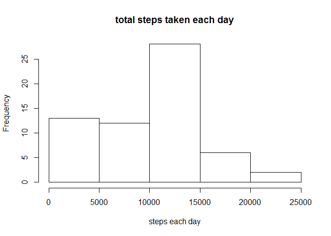
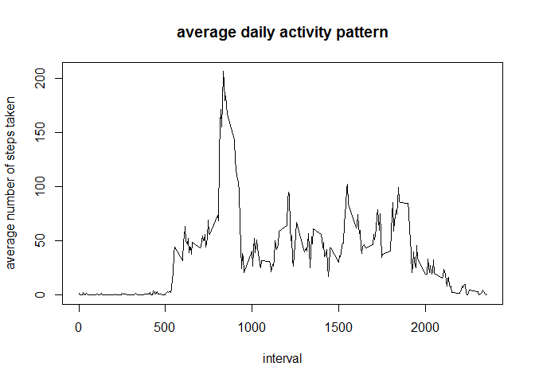
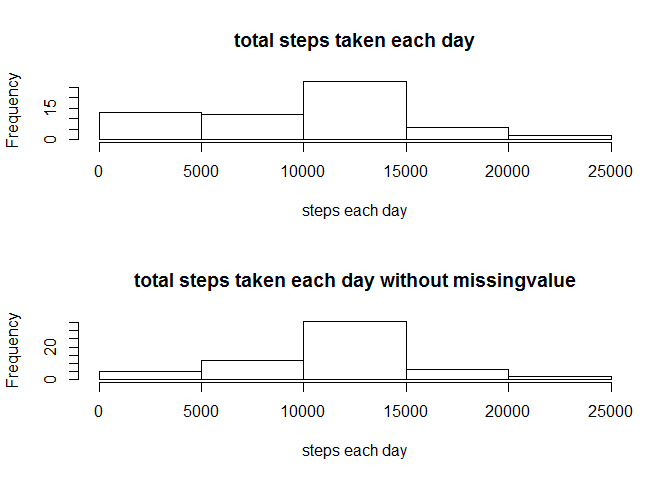
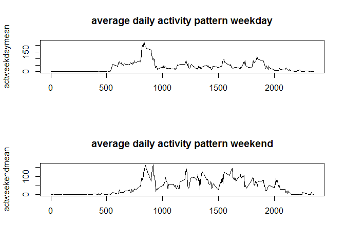

# Reproducible Research: Peer Assessment 1
This is a report about the assignment 

## Loading and preprocessing the data
1. read the dataset and processing the data

```r
activity<- read.csv("activity.csv",header = TRUE)
activity$date<-as.Date(activity$date)
actdate<-split(activity,activity$date)
actdatemean<-sapply(actdate, function(x) sum(x$steps,na.rm = TRUE))
```

## What is mean total number of steps taken per day?
2.and the Histogram of the total number of steps taken each day 


```r
hist(actdatemean,main = "total steps taken each day",xlab = "steps each day")
```

\

```r
dev.copy(png,"instructions_fig/total_steps_taken_each_day.png")
```

```
## png 
##   3
```

```r
dev.off()
```

```
## png 
##   2
```

3.the mean and median number of steps taken each day


```r
summary(actdatemean)
```

```
##    Min. 1st Qu.  Median    Mean 3rd Qu.    Max. 
##       0    6778   10400    9354   12810   21190
```

processing the data

```r
actint<-split(activity,activity$interval)
actintmean<-sapply(actint, function(x) mean(x$steps,na.rm = TRUE))
interval<-names(actint)
```
## What is the average daily activity pattern?
4.Time series plot of the average number of steps taken

```r
plot(actintmean~interval,type="l",main="average daily activity pattern",ylab ="average number of steps taken" )
```

\

```r
dev.copy(png,"instructions_fig/average_daily_activity_pattern.png")
```

```
## png 
##   3
```

```r
dev.off()
```

```
## png 
##   2
```

5.The 5-minute interval that, on average, contains the maximum number of steps

```r
maxsteps<-interval[which.max(actintmean)]
paste("the interval contains the maxinmum number of steps is",maxsteps,"-",as.numeric(maxsteps)+5)
```

```
## [1] "the interval contains the maxinmum number of steps is 835 - 840"
```
## Imputing missing values
6. Describe and show a strategy for imputing missing data

```r
#getting the total number of  missing value
missvalue<- sum(is.na(activity$steps))
paste("the number of missing value is",missvalue)
```

```
## [1] "the number of missing value is 2304"
```

```r
##fill the missing data
activity1<-activity
#figure out where is the na,turns out ,there are somedays have no data at all
#so I just filling the missing value with the mean fo the 5-minute interval
nas<-sapply(actdate,function(x) sum(is.na(x$steps)))
for (i in 1:17568) {
    if (is.na(activity$steps[i])){
    activity1$steps[i]<- actintmean[which(as.integer(interval)==activity$interval[i])]
    }
}
```

7.Histogram of the total number of steps taken each day after missing values are imputed,and compare to the
histogram before,it differ from the estimates from the first part of the assignment.
After that ,the number of midlevel value grow up

```r
actdate1<-split(activity1,activity1$date)
actdatemean1<-sapply(actdate1, function(x) sum(x$steps,na.rm = TRUE))
summary(actdatemean1)
```

```
##    Min. 1st Qu.  Median    Mean 3rd Qu.    Max. 
##      41    9819   10770   10770   12810   21190
```

```r
par(mfrow=c(2,1))
hist(actdatemean,main = "total steps taken each day",xlab = "steps each day")
hist(actdatemean1,main = "total steps taken each day without missingvalue",xlab = "steps each day")
```

\

```r
dev.copy(png,"instructions_fig/Compare_total_steps_each_day.png")
```

```
## png 
##   3
```

```r
dev.off()
```

```
## png 
##   2
```
## Are there differences in activity patterns between weekdays and weekends?
8.Panel plot comparing the average number of steps taken per 5-minute interval across weekdays and weekends

```r
par(mfrow=c(2,1))
activity1$weekday<- weekdays(activity1$date)
activity1$weekday<- with(activity1, sapply(weekday,function(x) if (sum(x== "星期六",x== "星期日")==1) {x <- "weekend"} else {x<- "weekday"}))
actweek<-split(activity1,activity1$weekday)
actweekday<-split(actweek$weekday,actweek$weekday$interval)
actweekend<-split(actweek$weekend,actweek$weekend$interval)
actweekdaymean<-sapply(actweekday, function(x) mean(x$steps,na.rm = TRUE))
intervalweekday<-names(actweekday)
plot(actweekdaymean~intervalweekday,type="l",main="average daily activity pattern weekday",xlab = "")
actweekendmean<-sapply(actweekend, function(x) mean(x$steps,na.rm = TRUE))
intervalweekend<-names(actweekend)
plot(actweekendmean~intervalweekend,type="l",main="average daily activity pattern weekend",xlab = "")
```

\

```r
dev.copy(png,"instructions_fig/compare_daily_activity_pattern_weekday&weekend.png")
```

```
## png 
##   3
```

```r
dev.off()
```

```
## png 
##   2
```
